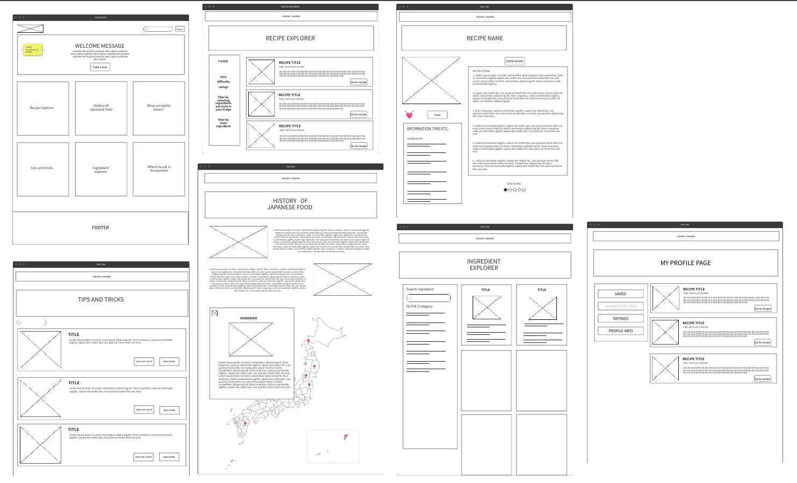
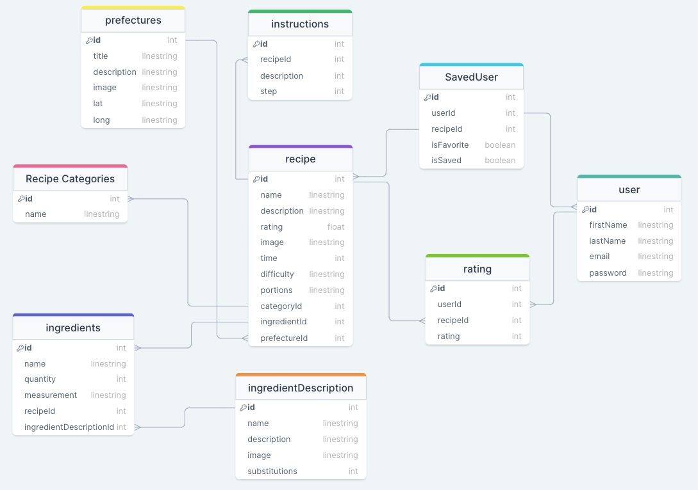

# Japaneasy

During the lockdown period I started a small bento box business. During this time I noticed that not many people know what homecooked Japanese food is outside of sushi, gyozas and karaage. I wanted to help my friends know a little bit more about how special Japan and Japanese food is, so I created this website.

| front-end          | back-end               |
| ------------------ | ---------------------- |
| React              | Express                |
| Redux              | Sequelize/Sequlize-cli |
| TypeScript         | PostgreSQL             |
| React Lottie       | ElephantSQL            |
| React Leaflet      | Bcrypt                 |
| React joyride      | JSON web token         |
| React Bootstrap    |                        |
| Axios              |                        |
| React Star Ratings |                        |

# Wireframes:

# Database tables:

# User stories:

- As a user I want to be able to be able to browse recipes
- As a user I want to be able to log in and see my saved and favorited recipes
- As a user I want to learn more about Japan, its prefectures and the specialities of each prefecture.
- As a user I want to be able to understand where everything is located on the website.
- As a user I want to be able to know what certain ingredients are and what to replace them with if I do not have them.
- As a user I want to be able to keep track of which step of the recipe instructions I am on

# Repositories:

- frontend repo: https://github.com/avdalmi/japaneasyFrontend
- backend repo: https://github.com/avdalmi/japaneasyBackend

# Download instructions:

- `git clone <SSH>`
- `npm install `
- for the front end repository react-lottie might throw errors, in that case first: `npm install react-lottie --force` then `npm install`
